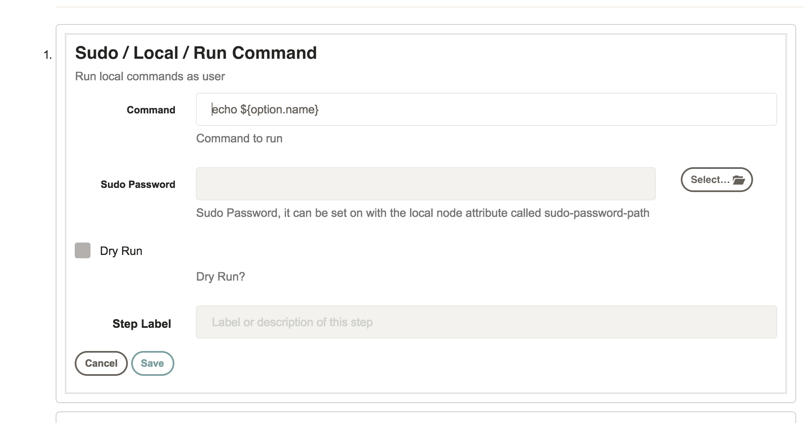
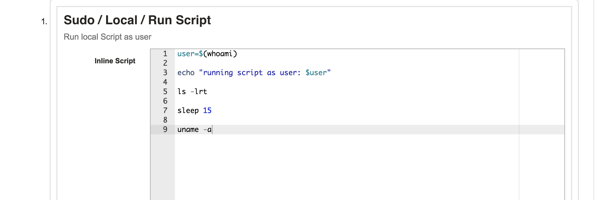

# Sudo Local Execution

This is a local execution plugin that allows run commands or scripts using a different user than then rundeck system account.
It contains 4 different plugins:

## Local Node Executor and Local File Copier

Set the local node executor and file copier on the rundeck server, for example:

```
local-node-executor=sudo-local-node-executor
local-file-copier=sudo-local-file-copier
username=test
sudo-password-path=keys/mac/ltoledo.password
```

To run commands as a different user, you need to set the `username` and the `sudo-password-path` attribute on the server node.


## Local Command Workflow Step

This is a workflow step that allows users to run local commands on a workflow.




## Local Script Workflow Step


This is a workflow step that allows users to run local scripts on a workflow.


